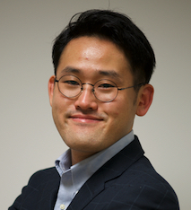

## About Me
Sung-Gwi Cho  
Assistant Professor  
Robotics Laboratory, Division of Information Science,  
Graduate school of Science and Technology,  
Nara Institute of Science and Technology  

Addres: 8916-5, Takayama-cho, Ikoma, Nara, 630-0192, Japan  
Email: cho[at]is.naist.jp  
Tel: 0743-72-5373

## Research Interests
Main topic: Estimation and analysis of Upper limb motion 
Research fields: Biomedical engineering, human-machine Interface, bio-signal Processing

## Professional Experence
Assistant Professor (Apr./2020 - Present)  
Robotics Laboratory, Information Science Division,  
Graduate school of Science and Technology,  
Nara Institute of Science and Technology  

## Education
**Ph.D. degree in Engineering**  
Apr./2017 - Mar./2020   
in Robotics Lab., Graduate School of Information Science,  
Nara Institute of Science and Technology (NAIST)  
Advised by Professor Tsukasa Ogasawara  
**M.S. degree in Engineering**  
Apr./2015 - Mar./2017  
in Robotics Lab., Graduate School of Information Science,  
Nara Institute of Science and Technology (NAIST)  
Advised by Professor Tsukasa Ogasawara  

## Technical skills
Programming: Python, C/C++/C#, Java, Matlab, R  
Tools: Git, Tex, Visual Studio, ROS, 3DCAD (Fusion360, Inventor), Arduino, Processing  
Language: Korean, Japanese, English  

## Societies
Institute of Electrical and Electronics Engineers (IEEE)  
The Robotics Society of Japan (RSJ)  
The Japan Society of Mechanical Engineering (JSME)  

## Funding
1. Grant-in-Aid for Young Scientists (Start-up), 2020-2021
1. Research grant (C) (grant number 2187007), Tateisi Science and Technology Foundation, 2018
1. The Creative and International Competitiveness Project (CICP), 2017
1. The Creative and International Competitiveness Project (CICP), 2016

## Honor & Award
1. Best research award, the Creative and International Competitiveness Project (CICP), 2017
1. Best research award, the Creative and International Competitiveness Project (CICP), 2016
1. Research encouragement A, Seiwa Memorial Foundation, 2017
1. Research encouragement B, Seiwa Memorial Foundation, 2015
1. Exemption from JASSO Scholarship Refund for Excellent Student, 2017
1. Scholarship student, The Yushin Science Education Promotion Association, 2017 - 2019
1. Scholarship student, The Korean Scholarship Foundation, 2019
1. Scholarship student, The Korean Scholarship Foundation, 2016

## Publications
**Journal**
1. Tetsuya Kurasumi, <u>Sung-Gwi Cho</u>, Ming Ding, Gustavo Alfonso Garcia Ricardez, Masahiro Yoshikawa, Jun Takamatsu and Tsukasa Ogasawara: “Simultaneous Estimation of Upper Limb Pose and Joint Torque Based on Upper Arm Deformation”, IEEE Transactions on Medical Robotics and Bionics, vol. 2, no. 3, pp. 374-381, 2020.
1. Ming Ding, Mikihisa Nagashima, <u>Sung-Gwi Cho</u>, Jun Takamatsu and Tsukasa Ogasawara: “Control of Walking Assist Exoskeleton With Time-delay Based on the Prediction of Plantar Force”, IEEE Access, vol. 8, pp. 138642-138651, 2020. 
1. <u>Sung-Gwi Cho</u>, Masahiro Yoshikawa, Ming Ding, Jun Takamatsu, and Tsukasa Ogasawara, “Machine-learning-based Hand Motion Recognition System by Measuring Forearm Deformation with a Distance Sensor Array,” International Journal of Intelligent Robotics and Applications, vol. 3, no. 4, pp. 418-429, 2019.

**International conference**
1. Tomoko Yui, Tomoki Ishikura, <u>Sung-Gwi Cho</u>, Ming Ding, Jun Takamatsu, Tsukasa Ogasawara, “A Quantitative Measurement of Hand Scaling Motion for Dental Hygienist Training,” in Proceedings of the Annual International Conference of the IEEE Engineering in Medicine and Biology Society (EMBC2020), pp. xx-xx, Online, Jul, 2020. (Accepted)
1. <u>Sung-Gwi Cho</u>, Tetsuya Kurasumi, Masahiro Yoshikawa, Ming Ding, Jun Takamatsu, and Tsukasa Ogasawara, “Estimation of Forearm Pose Based on Upper Arm Deformation Using a Deep Neural Network,” in Proceedings of the IEEE International Conference on Robotics and Biomimetics (ROBIO2018), pp. 1245-1250, Dali, China, Dec, 2019.
1. Tetsuya Kurasumi, <u>Sung-Gwi Cho</u>, Ming Ding, Gustavo Alfonso Garcia Ricardez, Jun Takamatsu, and Tsukasa Ogasawara, "Simultaneous Estimation of Elbow Joint Angle and Load Based on Upper Arm Deformation", in Proceedings of the IEEE International Conference on Cyborg and Bionic Systems (CBS), pp. 136-141, Munich, Germany, Sep, 2019.
1. Mikihisa Nagashima, <u>Sung-Gwi Cho</u>, Ming Ding, Jun Takamatsu, and Tsukasa Ogasawara, "Prediction of Plantar Forces During Gait Using Wearable Sensors and Deep Neural Networks", in Proceedings of the Annual International Conference of the IEEE Engineering in Medicine and Biology Society (EMBC2019), pp. 3629-3632, Berlin, Germany, Jul, 2019.
1. <u>Sung-Gwi Cho</u>, Masahiro Yoshikawa, Ming Ding, Jun Takamatsu, and Tsukasa Ogasawara, "Estimation of Hand Motion Based on Forearm Deformation," in Proceedings of the IEEE International Conference on Robotics and Biomimetics (ROBIO2018), pp. 2291-2296, Kuala Lumpur, Malaysia, Dec, 2018.
1. Felix von Drigalski, Marcus Gall, <u>Sung-Gwi Cho</u>, Ming Ding, Jun Takamatsu, Tsukasa Ogasawar, and Tamim Asfour: “Textile Identification Using Fingertip Motion and 3D Force Sensors in an Open-Source Gripper,” in Proceedings of the IEEE International Conference on Robotics and Biomimetics (ROBIO2017), pp. 424-429, Macau SAR, China, 2017. 
1. <u>Sung-Gwi Cho</u>, Masahiro Yoshikawa, Ming Ding, Jun Takamatsu, and Tsukasa Ogasawara, "Hand Motion Recognition Using a Distance Sensor Array," in Proceedings of the IEEE International Symposium on Robot and Human Interactive Communication (RO-MAN2017), pp. 1459-1484, Lisbon, Portugal, Aug, 2017.
1. Felix von Drigalski, Daiki Yoshioka, Wataru Yamazaki, <u>Sung-Gwi Cho</u>, Marcus Gall, Pedro Miguel Uriguen Eljuri, Viktor Hoerig, Jessica Beltran, Ming Ding, Jun Takamatsu, and Tsukasa Ogasawara, "NAIST Openhand M2S: A Versatile Two-Finger Gripper Adapted for Pulling and Tucking Textile," in Proceedings of the IEEE International Conference on Robotic Computing (IRC2017), pp. 117-122, Taiwan, Taichung, Apr, 2017
1. <u>Sung-Gwi Cho</u>, Masahiro Yoshikawa, Kohei Baba, Kazunori Ogawa, Jun Takamatsu, and Tsukasa Ogasawara, "Hand Motion Recognition Based on Forearm Deformation Measured with A Distance Sensor Array," in Proceedings of the Annual International Conference of the IEEE Engineering in Medicine and Biology Society (EMBC2016), pp.4955-4958, Orland, USA, Aug, 2016.

**Domestic conference**
1. <u>趙 崇貴</u>, 倉角 哲也, 吉川 雅博, 丁 明, 高松 淳, 小笠原 司：“深層学習を用いた上腕形状変化に基づく肘と前腕の関節角度推定,” 第37回日本ロボット学会学術講演会（RSJ2019）, 1N2-02, 2019. 
1. 倉角 哲也, <u>趙 崇貴</u>, 丁 明, Gustavo Alfonso Garcia Ricardez, 高松 淳, 小笠原 司: “上肢動作推定のための上腕形状計測可能な距離センサアレイの開発,” ロボティクス・メカトロニクス講演会2019, 2P1-N06, 広島, 5月, 2019. 
1. 樋口 太也, <u>趙 崇貴</u>, 丁 明, 高松 淳, 小笠原 司: “歩行時における一部身体動作を用いた全身動作の推定,” 日本機械学会 シンポジウム：スポーツ工学・ヒューマンダイナミクス2018（SHD2018）, A-13,　京都, 11月, 2018.
1. 木下 勝吏, <u>趙 崇貴</u>, 丁 明, 高松 淳, 小笠原 司: “IMUと距離センサを用いたボート競技の漕艇動作の計測と精度評価,” シンポジウム：スポーツ工学・ヒューマンダイナミクス2018（SHD2018）, A-15,　京都, 11月, 2018.
1. <u>趙 崇貴</u>, 吉川 雅博, 丁 明, 高松 淳, 小笠原 司: “距離センサアレイを用いた上腕形状計測に基づく肘関節角度の推定,” 第36回日本ロボット学会学術講演会（RSJ2018）, 3A1-05, 春日井, 9月, 2018. 
1. <u>趙 崇貴</u>, 清川 拓哉, 友近 圭汰, 吉川 雅博, 小笠原 司: "前腕形状計測に基づく手の動作認識によるロボットアームの操作," ヒューマンインタフェースシンポジウム2017, pp.941-944, 大阪, 9月, 2017.
1. <u>趙 崇貴</u>, 吉川 雅博, 丁 明, 高松 淳, 小笠原 司: "距離センサアレイを用いた前腕形状計測に基づく手の関節角度の推定," ロボティクス・メカトロニクス講演会2017 (ROBOMECH2017), pp.2P2-M07, 郡山, 6月, 2017.
1. Felix von Drigalski, Daiki Yoshioka, Marcus Gall, Pedro Miguel Uriguen Eljuri, Wataru Yamazaki, <u>Sung-Gwi Cho</u>, Viktor Hoerig, Jessica Beltran,, Ming Ding, Jun Takamatsu and Tsukasa Ogasawara: "A robotic system for automated bed-making using a gripper specialized for textile manipulation", ロボティクス・メカトロニクス講演会2017 (ROBOMECH2017), 2P2-G10, 郡山, 6月, 2017.
1. Viktor Hoerig, Felix von Drigalski, Daiki Yoshioka, Marcus Gall, Pedro Miguel Uriguen Eljuri, Wataru Yamazaki, <u>Sung-Gwi Cho</u>, Jessica Beltran, Ming Ding, Jun Takamatsu and Tsukasa Ogasawara: "Development of an Elastic Finger Joint of a Robotic Gripper For Picking Up Thin, Easily Deformable Objects," ロボティクス・メカトロニクス講演会2017 (ROBOMECH2017), 2P1-D08, 郡山, 6月, 2017.
1. <u>趙 崇貴</u>, 吉川 雅博, 丁 明, 高松 淳, 小笠原 司: "前腕の三次元モデルに基づく距離センサアレイによる手の動作認識," 第17回計測自動制御学会システムインテグレーション部門講演会（SI2016）, 3K3-2, 札幌, 12月, 2016.
1. 神田 将輝, <u>趙 崇貴</u>, 吉川 雅博, 高松 淳, 小笠原 司: "シーンに応じてエンドエフェクタを換装可能な2自由度電動義手," ロボティクスメカトロニクス講演会2016 (ROBOMECH2016), 2A1-02a4, 横浜, 6月, 2016.
1. <u>趙 崇貴</u>, 神田 将輝, 吉川 雅博, 高松 淳, 小笠原 司: "箸による食事支援を目的とした電動義手の開発," 日本家政学会第68回大会, P-138, 名古屋, 5月, 2016.
